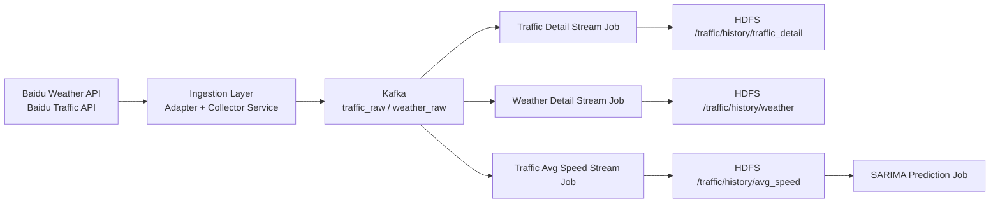

# Traffic Data System（单轨重构版）

## 1. 系统目标

本项目提供一条完整、清晰、可扩展的数据链路：

1. 实时采集交通与天气数据
2. 统一字段标准化
3. Kafka 缓冲与解耦
4. Spark Streaming 清洗与聚合
5. HDFS 历史沉淀（可接 Hive）
6. 预测任务接入（SARIMA）

## 2. 数据流（可视化）



## 3. 当前唯一代码结构

```text
src/
  core/
    config.py
  ingestion/
    adapters/baidu_adapters.py
    clients/baidu_api_client.py
    repositories/road_repository.py
    services/collector_service.py
    jobs/run_collector_job.py
  messaging/
    kafka_producer.py
  streaming/
    runtime.py
    schemas.py
    jobs/
      traffic_detail_stream_job.py
      weather_detail_stream_job.py
      traffic_avg_speed_stream_job.py
  prediction/
    jobs/sarima_predict_job.py
scripts/
  start_stack.sh
  stop_stack.sh
  attach_stack.sh
```

## 4. 环境准备

### 4.1 初始化配置

```bash
cp .env.example .env
```

至少配置：
1. `BAIDU_AK`
2. `PROJECT_ROOT`
3. `ROAD_LIST_FILE`
4. `KAFKA_BOOTSTRAP_SERVERS`

### 4.2 Python 依赖

```bash
pip install requests python-dotenv kafka-python pyspark
```

### 4.3 WSL 终端编排依赖

```bash
sudo apt-get update
sudo apt-get install -y tmux
```

## 5. 一键启动（推荐，WSL）

> 场景：先启 Zookeeper/Kafka，再同时拉起 5 个运行终端。

在项目根目录执行：

```bash
bash scripts/start_stack.sh
```

脚本会创建一个 `tmux` 会话（默认名：`traffic-stack`），并启动：
1. `zookeeper`
2. `kafka`
3. `collector`
4. `traffic_detail`
5. `weather_detail`
6. `avg_speed`
7. `traffic_watch`（Kafka 监控窗口，可关闭）

常用操作：

```bash
# 重新连接会话
bash scripts/attach_stack.sh

# 一键停止全部进程
bash scripts/stop_stack.sh
```

## 6. 一键脚本可配置项（可选）

你可以在启动前导出以下变量：

```bash
export SESSION_NAME=traffic-stack
export KAFKA_HOME=/mnt/d/bigdata/apps/kafka
export SPARK_HOME=/mnt/d/bigdata/apps/spark
export SPARK_KAFKA_PACKAGE=org.apache.spark:spark-sql-kafka-0-10_2.12:3.5.0
export ENABLE_MONITOR=true
export WAIT_SECONDS=60
bash scripts/start_stack.sh
```

## 7. 手动启动（备用）

### 7.1 采集任务

```bash
cd /mnt/d/bigdata/myproject
source .venv/bin/activate
export PYTHONPATH=src
python src/ingestion/jobs/run_collector_job.py
```

### 7.2 三个 Spark 流任务

```bash
cd /mnt/d/bigdata/apps/spark
bin/spark-submit --packages org.apache.spark:spark-sql-kafka-0-10_2.12:3.5.0 /mnt/d/bigdata/myproject/src/streaming/jobs/traffic_detail_stream_job.py
bin/spark-submit --packages org.apache.spark:spark-sql-kafka-0-10_2.12:3.5.0 /mnt/d/bigdata/myproject/src/streaming/jobs/weather_detail_stream_job.py
bin/spark-submit --packages org.apache.spark:spark-sql-kafka-0-10_2.12:3.5.0 /mnt/d/bigdata/myproject/src/streaming/jobs/traffic_avg_speed_stream_job.py
```

## 8. 运行校验

### 8.1 Kafka

```bash
cd /mnt/d/bigdata/apps/kafka
bin/kafka-console-consumer.sh --bootstrap-server localhost:9092 --topic traffic_raw --from-beginning
```

### 8.2 HDFS

```bash
hdfs dfs -ls /traffic/history/traffic_detail
hdfs dfs -ls /traffic/history/weather
hdfs dfs -ls /traffic/history/avg_speed
```

## 9. 后续建议

1. 为 `prediction/jobs/sarima_predict_job.py` 实现真实预测流程。
2. 给 `streaming/jobs` 增加基础单元测试与回放测试。
3. 增加可视化层（地图 + 趋势图）读取聚合结果。
