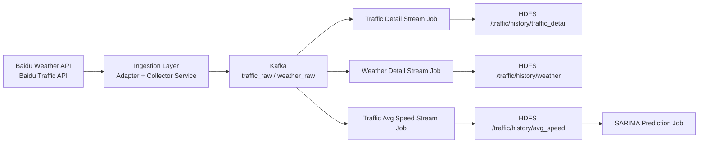

# Traffic Data System（单轨重构版）

## 1. 系统目标

本项目提供一条完整、清晰、可扩展的数据链路：

1. 实时采集交通与天气数据
2. 统一字段标准化
3. Kafka 缓冲与解耦
4. Spark Streaming 清洗与聚合
5. HDFS 历史沉淀（可接 Hive）
6. 预测任务接入（SARIMA）

## 2. 数据流（可视化）



## 3. 当前唯一代码结构（无兼容壳）

```text
src/
  core/
    config.py

  ingestion/
    adapters/
      baidu_adapters.py
    clients/
      baidu_api_client.py
    repositories/
      road_repository.py
    services/
      collector_service.py
    jobs/
      run_collector_job.py

  messaging/
    kafka_producer.py

  streaming/
    runtime.py
    schemas.py
    jobs/
      traffic_detail_stream_job.py
      weather_detail_stream_job.py
      traffic_avg_speed_stream_job.py

  prediction/
    jobs/
      sarima_predict_job.py
```

## 4. 配置

### 4.1 初始化

```bash
cp .env.example .env
```

### 4.2 必填配置

1. `BAIDU_AK`
2. `PROJECT_ROOT`
3. `ROAD_LIST_FILE`
4. `KAFKA_BOOTSTRAP_SERVERS`

### 4.3 依赖

```bash
pip install requests python-dotenv kafka-python pyspark
```

## 5. 运行入口（新版）

### 5.1 采集任务

```bash
cd /mnt/d/bigdata/myproject
source .venv/bin/activate
export PYTHONPATH=src
python src/ingestion/jobs/run_collector_job.py
```

### 5.2 交通明细流

```bash
cd /mnt/d/bigdata/apps/spark
bin/spark-submit \
  --packages org.apache.spark:spark-sql-kafka-0-10_2.12:3.5.0 \
  /mnt/d/bigdata/myproject/src/streaming/jobs/traffic_detail_stream_job.py
```

### 5.3 天气明细流

```bash
cd /mnt/d/bigdata/apps/spark
bin/spark-submit \
  --packages org.apache.spark:spark-sql-kafka-0-10_2.12:3.5.0 \
  /mnt/d/bigdata/myproject/src/streaming/jobs/weather_detail_stream_job.py
```

### 5.4 平均速度聚合流

```bash
cd /mnt/d/bigdata/apps/spark
bin/spark-submit \
  --packages org.apache.spark:spark-sql-kafka-0-10_2.12:3.5.0 \
  /mnt/d/bigdata/myproject/src/streaming/jobs/traffic_avg_speed_stream_job.py
```

### 5.5 预测任务入口（占位）

```bash
python src/prediction/jobs/sarima_predict_job.py
```

## 6. 运行校验

### 6.1 Kafka

```bash
cd /mnt/d/bigdata/apps/kafka
bin/kafka-console-consumer.sh \
  --bootstrap-server localhost:9092 \
  --topic traffic_raw \
  --from-beginning
```

### 6.2 HDFS

```bash
hdfs dfs -ls /traffic/history/traffic_detail
hdfs dfs -ls /traffic/history/weather
hdfs dfs -ls /traffic/history/avg_speed
```

## 7. 关闭顺序

```bash
kafka-server-stop.sh
zkServer.sh stop
hive --service metastore >/dev/null 2>&1
stop-yarn.sh
stop-dfs.sh
```

## 8. 后续建议

1. 为 `prediction/jobs/sarima_predict_job.py` 实现从 `avg_speed` 读取和落库。
2. 给 `streaming/jobs` 增加基础单元测试与样本回放测试。
3. 增加可视化层（地图 + 趋势图）读取聚合结果。
