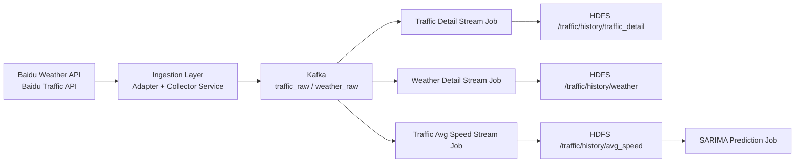

# Traffic Data System（单轨重构版）

## 1. 系统目标

本项目提供一条完整、清晰、可扩展的数据链路：

1. 实时采集交通与天气数据
2. 统一字段标准化
3. Kafka 缓冲与解耦
4. Spark Streaming 清洗与聚合
5. HDFS 历史沉淀（可接 Hive）
6. 预测任务接入（SARIMA）

## 2. 数据流（可视化）



## 3. 代码结构

```text
src/
  core/
    config.py

  ingestion/
    adapters/baidu_adapters.py
    clients/baidu_api_client.py
    repositories/road_repository.py
    services/collector_service.py
    jobs/run_collector_job.py

  messaging/
    kafka_producer.py

  streaming/
    runtime.py
    schemas.py
    jobs/
      traffic_detail_stream_job.py
      weather_detail_stream_job.py
      traffic_avg_speed_stream_job.py

  prediction/
    jobs/sarima_predict_job.py

scripts/
  start_stack.sh
  start_stack_ide.sh
  attach_stack.sh
  check_stack.sh
  stack_dashboard.py
  stop_stack.sh
```

## 4. 环境准备

### 4.1 初始化配置

```bash
cp .env.example .env
```

至少配置：
1. `BAIDU_AK`
2. `PROJECT_ROOT`
3. `ROAD_LIST_FILE`
4. `KAFKA_BOOTSTRAP_SERVERS`

### 4.2 Python 依赖

```bash
pip install requests python-dotenv kafka-python pyspark
```

### 4.3 WSL 依赖

```bash
sudo apt-get update
sudo apt-get install -y tmux
```

可选（首次拉仓库后执行一次）：

```bash
chmod +x scripts/*.sh
```

## 5. 一键脚本工作流（推荐）

### 5.1 启动全栈

```bash
bash scripts/start_stack.sh
```

实际行为（与脚本一致）：
1. 读取项目根目录 `.env`（若存在）
2. 创建 tmux 会话（默认 `traffic-stack`）
3. 启动 `zookeeper` 与 `kafka`
4. 等待 2181/9092 端口就绪
5. 启动 `collector`、`traffic_detail`、`weather_detail`、`avg_speed`
6. 启动 `traffic_watch`（当 `ENABLE_MONITOR=true`）
7. 自动 `attach` 到该 tmux 会话

### 5.2 重新连接会话

```bash
bash scripts/attach_stack.sh
```

### 5.3 全链路冒烟检查

```bash
bash scripts/check_stack.sh
```

检查项：
1. tmux 会话和关键窗口是否存在
2. 2181/9092 端口是否可达
3. Kafka topic 是否存在（`traffic_raw` / `weather_raw`）
4. topic 是否可读到消息
5. HDFS 输出目录是否存在并包含 `part-*` 文件

退出码：
1. `0` 全部通过
2. `1` 存在失败项
3. `2` 无失败但有告警（例如刚启动暂未落盘）

常用选项：

```bash
STRICT=false bash scripts/check_stack.sh
```

### 5.4 停止全栈

```bash
bash scripts/stop_stack.sh
```

### 5.5 IDE 可视化观测模式（推荐）

如果你不想进入 tmux 看大量日志，而是希望在 PyCharm 终端看到“成功/失败/告警”的全链路状态面板，使用：

```bash
bash scripts/start_stack_ide.sh
```

该命令会：
1. 以 `AUTO_ATTACH=false` 方式启动全栈（不自动进入日志窗口）
2. 自动进入 `stack_dashboard.py --watch` 持续刷新面板
3. 展示关键链路状态（tmux窗口、端口、topic、消息、HDFS产出）

你也可以单独运行面板：

```bash
python scripts/stack_dashboard.py
python scripts/stack_dashboard.py --watch
python scripts/stack_dashboard.py --watch --interval 3
```

## 6. 脚本可配置环境变量

`start_stack.sh` 相关：

```bash
export SESSION_NAME=traffic-stack
export KAFKA_HOME=/mnt/d/bigdata/apps/kafka
export SPARK_HOME=/mnt/d/bigdata/apps/spark
export SPARK_KAFKA_PACKAGE=org.apache.spark:spark-sql-kafka-0-10_2.12:3.5.0
export PYTHON_BIN=python3
export ENABLE_MONITOR=true
export WAIT_SECONDS=60
export AUTO_ATTACH=true
```

`check_stack.sh` 相关：

```bash
export KAFKA_BOOTSTRAP_SERVERS=localhost:9092
export KAFKA_TRAFFIC_TOPIC=traffic_raw
export KAFKA_WEATHER_TOPIC=weather_raw
export TOPIC_TIMEOUT_MS=15000
export PORT_WAIT_SECONDS=20
export STRICT=true
```

`start_stack_ide.sh` / `stack_dashboard.py` 相关：

```bash
export DASHBOARD_INTERVAL=5
```

输出路径变量（用于检查 HDFS 落盘）：

```bash
export TRAFFIC_DETAIL_OUTPUT_PATH=hdfs://localhost:9000/traffic/history/traffic_detail
export WEATHER_OUTPUT_PATH=hdfs://localhost:9000/traffic/history/weather
export AVG_SPEED_OUTPUT_PATH=hdfs://localhost:9000/traffic/history/avg_speed
```

## 7. 手动启动（备用）

### 7.1 启动采集任务

```bash
cd /mnt/d/bigdata/myproject
source .venv/bin/activate
export PYTHONPATH=src
python src/ingestion/jobs/run_collector_job.py
```

### 7.2 启动三个 Spark 流任务

```bash
cd /mnt/d/bigdata/apps/spark
bin/spark-submit --packages org.apache.spark:spark-sql-kafka-0-10_2.12:3.5.0 /mnt/d/bigdata/myproject/src/streaming/jobs/traffic_detail_stream_job.py
bin/spark-submit --packages org.apache.spark:spark-sql-kafka-0-10_2.12:3.5.0 /mnt/d/bigdata/myproject/src/streaming/jobs/weather_detail_stream_job.py
bin/spark-submit --packages org.apache.spark:spark-sql-kafka-0-10_2.12:3.5.0 /mnt/d/bigdata/myproject/src/streaming/jobs/traffic_avg_speed_stream_job.py
```

## 8. 后续建议

1. 为 `prediction/jobs/sarima_predict_job.py` 实现真实预测流程。
2. 给 `streaming/jobs` 增加基础单元测试与回放测试。
3. 增加可视化层（地图 + 趋势图）读取聚合结果。
